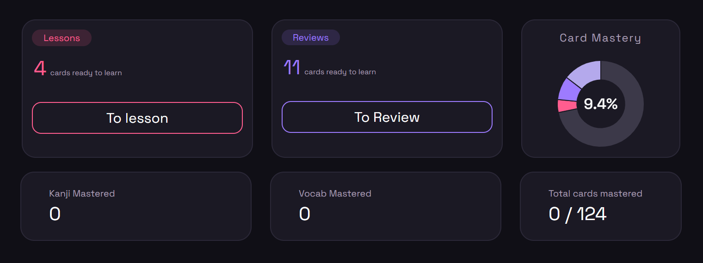
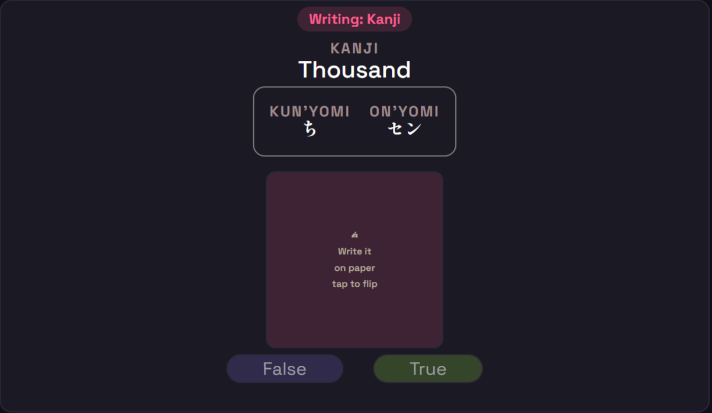
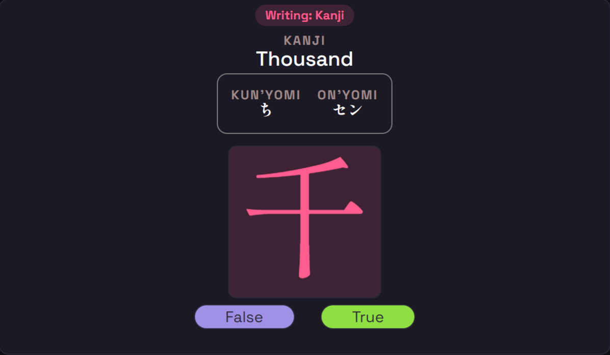
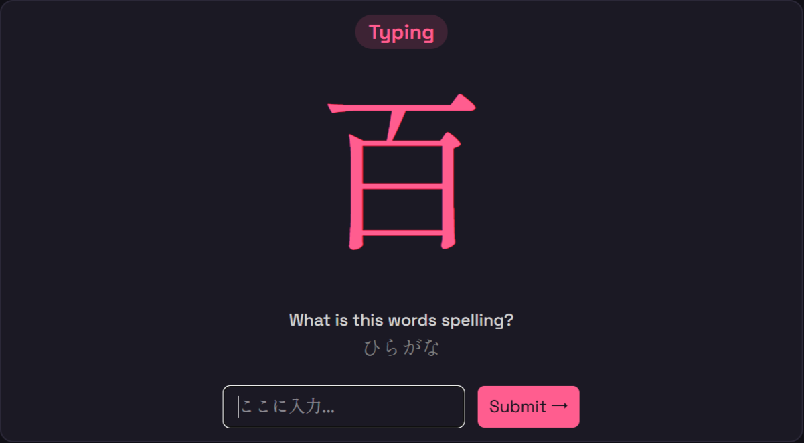

    

# SrsyDuts
SrsyDuts is a interactive Spaced-Repititon Japanese vocabulary tool, with a heavy focus on learning kanji. There are 3 features, lessons, writing practice, and typing.

## Pics

Dashboard

    

Writing Practice

    
     

Typing Practice

    

## What it does

## How it works

## Run it

## The stack

## Note

## License

