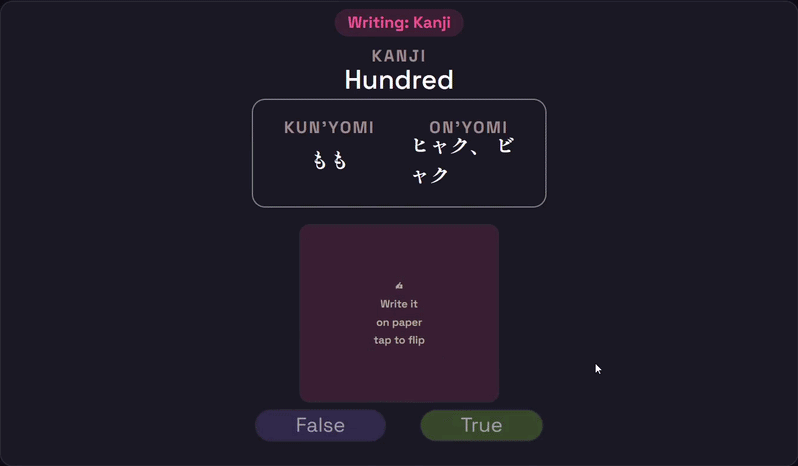

    

#

    <a href="https://www.srsyduts.com">SrsyDuts.com</a>

  <a href="#features">About The Project</a> •
  <a href="#spaced-repitition-system">Spaced-Repitition</a> •
  <a href="#the-stack">The Stack</a> •
  <a href="#run-it">Run it locally</a> •
  <a href="#license">License</a>

  

    

 

SrsyDuts is a interactive Spaced-Repititon Japanese vocabulary tool, with a heavy focus on learning kanji.

## Pics

Dashboard

    

Writing Practice

    
     

Typing Practice

    

## Features
- Get familiar with kanji and vocabulary in the lesson stage.
- Practice writing kanji by hand before learning the words that use them.
- Unlock new vocabulary after mastering the kanji it's built from.
- Spaced-repetition scheduling keeps hundreds of cards manageable.

## Spaced-Repitition-System
<h3>How it works?</h3>
Instead of creating a huge stack of vocabulary cards, a spaced-repitition system (SRS for short) allows us to juggle giant stacks of cards without overwhelming yourself. Each card gets a **review date**. When that date comes, the user is questioned on their retention of the card, and if they get that card correct, its review date is pushed back. If the user is incorrect, the review date is sooner next time around.

## Architecture

## Run it

## Note

## License

